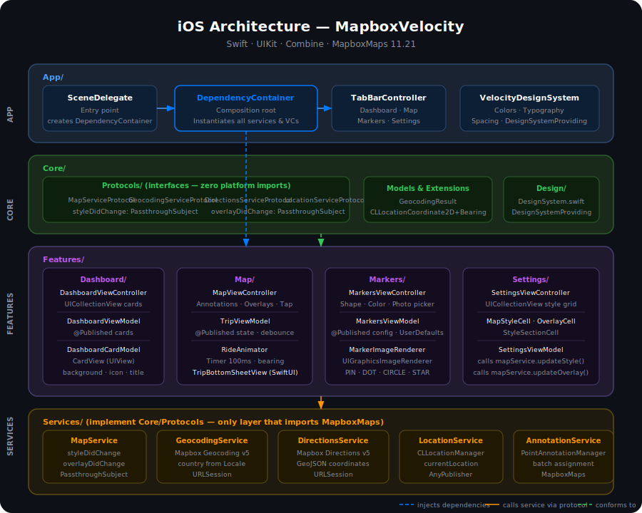
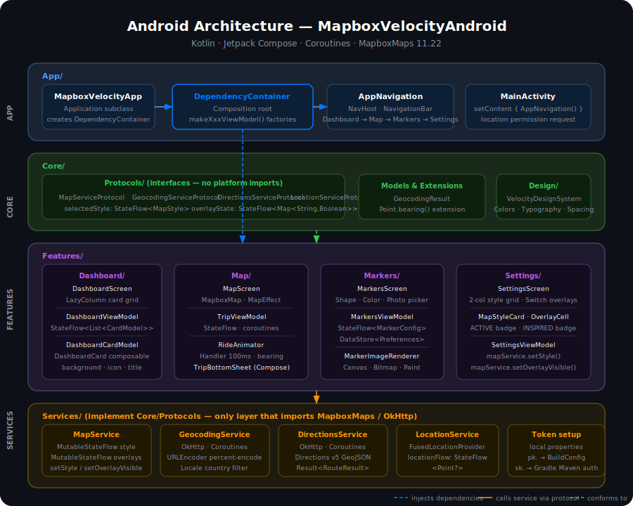
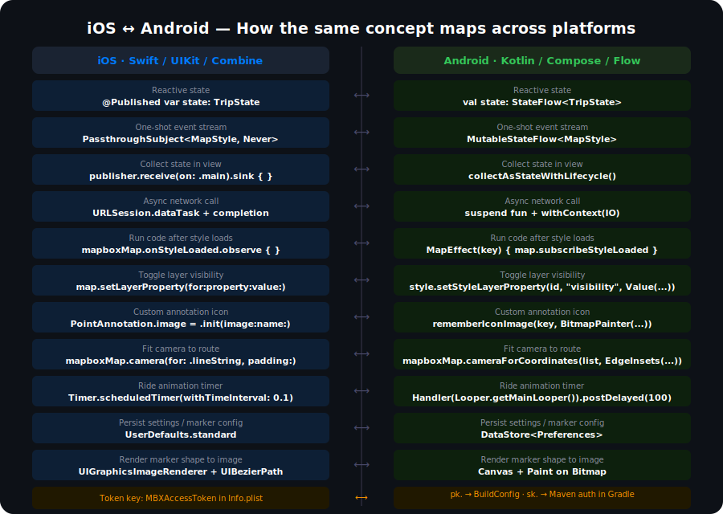

# Mapbox Velocity Lab

A side-by-side iOS and Android implementation of the same ride-sharing demo app, built to explore how Mapbox Maps SDK works on both platforms and how clean architecture translates across ecosystems.

---

## What this project is

Two fully working apps — one in Swift/UIKit, one in Kotlin/Jetpack Compose — that share the same product features, the same data flow, and the same architectural decisions. Every screen, every service, and every ViewModel has a direct counterpart on the other platform. Reading them side by side is the point.

---

## Features

- Interactive map with dark/satellite/heatmap/custom Wolt style switching
- Address search with live suggestions (Mapbox Geocoding API)
- Tap-to-drop pickup and destination pins
- Route drawing between two points (Mapbox Directions API)
- Animated vehicle ride simulation along the route
- 3D buildings and real-time traffic overlay layers
- Marker customization — shape, color, custom photo, live preview
- Dashboard with card navigation
- Settings with map style grid and overlay toggles
- Location FAB that centers on user position

---

## Architecture

Both apps follow **MVVM + SOLID** with constructor-injected dependencies. The folder structure is identical by design.

### iOS


### Android


### iOS ↔ Android side-by-side


```
App/                    ← composition root, navigation, DependencyContainer
Core/
  Design/               ← design system (colors, typography, spacing)
  Extensions/           ← shared utilities (bearing calculation, etc.)
  Models/               ← plain data types (GeocodingResult)
  Protocols/            ← interfaces for every service
Features/
  Dashboard/            ← card grid, navigation
  Map/                  ← map, search, route, ride animation, bottom sheet
  Markers/              ← marker config editor with live preview
  Settings/             ← style picker, overlay toggles
Services/               ← concrete implementations of Protocols
```

### Why this structure

**Features are vertical slices.** Each feature owns its View + ViewModel + Model. A developer can open the `Map/` folder and find everything the map screen needs without hunting across the project.

**Core has zero knowledge of features.** It only provides shared contracts via protocols. Services implement those protocols. This enforces the Dependency Inversion Principle before a single line of Mapbox code is written.

**DependencyContainer is the only place concrete types are instantiated.** No feature creates its own dependencies. This makes every ViewModel unit-testable by swapping in a mock service.

---

## Data flow

```
Service  (Mapbox SDK / CoreLocation / OkHttp)
  ↓
ViewModel  (business logic, published state)
  ↓
View  (renders state, forwards user events back up)
```

ViewModels never import UIKit, MapboxMaps, or Compose. Views never call network APIs. Services are the only layer that touches platform SDKs.

---

## iOS — Swift / UIKit

| File | What it does |
|---|---|
| `App/DependencyContainer.swift` | Creates all services and wires ViewControllers via factory methods |
| `App/TabBarController.swift` | Tab setup, Dashboard first |
| `Core/Protocols/MapServiceProtocol.swift` | `styleDidChange` and `overlayDidChange` Combine publishers |
| `Services/MapService.swift` | Holds selected style, broadcasts changes via `PassthroughSubject` |
| `Services/GeocodingService.swift` | Mapbox Geocoding v5 with country filtering from device locale |
| `Services/DirectionsService.swift` | Mapbox Directions v5, parses GeoJSON coordinates |
| `Features/Map/MapViewController.swift` | Map setup, gesture recognizer, annotation management, overlay layers |
| `Features/Map/TripViewModel.swift` | Search debounce, geocode, route fetch, ride state machine |
| `Features/Map/RideAnimator.swift` | 100ms timer tick along route coordinates with bearing calculation |
| `Features/Map/TripBottomSheetView.swift` | SwiftUI sheet for vehicle picker, price summary, Book button |
| `Features/Markers/MarkerImageRenderer.swift` | Renders `UIImage` for PIN / DOT / CIRCLE / STAR shapes |
| `Features/Settings/SettingsViewController.swift` | UICollectionView style grid, overlay switches |

**Key iOS decisions:**
- MapboxMaps installed via **CocoaPods** (not SPM — the xcodeproj has a stale SPM reference)
- Always open `MapboxVelocity.xcworkspace`, never `.xcodeproj`
- Token key is `MBXAccessToken` in Info.plist — not `MGLMapboxAccessToken` (that is the v6 legacy key and produces a silent blank map)
- Overlay layers (`FillExtrusionLayer`, `LineLayer`) are added inside `onStyleLoaded` — never before
- Annotation batch: `manager.annotations = allAnnotations` as one assignment, not `add()` in a loop

---

## Android — Kotlin / Jetpack Compose

| File | What it does |
|---|---|
| `App/DependencyContainer.kt` | Same role as iOS — single composition root |
| `App/AppNavigation.kt` | Compose `NavHost` with bottom `NavigationBar`, Dashboard as start destination |
| `Core/Protocols/MapServiceProtocol.kt` | `StateFlow<MapStyle>` and `StateFlow<Map<String, Boolean>>` for overlays |
| `Services/MapService.kt` | `MutableStateFlow` implementation, mirrors iOS `PassthroughSubject` pattern |
| `Services/GeocodingService.kt` | OkHttp + coroutines, `URLEncoder` percent-encoding, locale country code |
| `Services/DirectionsService.kt` | OkHttp + coroutines, parses GeoJSON coordinates from Directions v5 |
| `Features/Map/MapScreen.kt` | `MapboxMap` composable, `MapEffect` for overlay layers, gesture listeners |
| `Features/Map/TripViewModel.kt` | Same state machine as iOS, coroutine-based with `StateFlow` |
| `Features/Map/RideAnimator.kt` | `Handler.postDelayed` ticker, same 100ms interval as iOS |
| `Features/Map/TripBottomSheet.kt` | Compose bottom panel, hides on Book (state → Riding) |
| `Features/Markers/MarkerImageRenderer.kt` | Renders `Bitmap` for each shape, same logic as iOS renderer |
| `Features/Settings/SettingsScreen.kt` | 2-column `LazyColumn` style grid, `Switch` overlay toggles |

**Key Android decisions:**
- Two tokens required — `MAPBOX_ACCESS_TOKEN` (`pk.`) for runtime, `MAPBOX_DOWNLOADS_TOKEN` (`sk.`) for Gradle to download the SDK from Mapbox's private Maven repo
- Both go in `local.properties` (gitignored) — see `local.properties.example`
- `MapEffect(styleUri)` re-runs the overlay layer setup whenever the style changes, replacing iOS's `onStyleLoaded` callback
- `collectAsStateWithLifecycle` from `lifecycle-runtime-compose` is required for safe StateFlow collection in Compose
- Overlay visibility uses `style.setStyleLayerProperty(id, "visibility", Value("visible"|"none"))` — same as iOS `setLayerProperty`

---

## iOS ↔ Android translation map

This is the most useful part for anyone moving between platforms.

| Concept | iOS | Android |
|---|---|---|
| Reactive state | `@Published` + Combine | `StateFlow` + `collectAsStateWithLifecycle` |
| One-shot events | `PassthroughSubject` | `StateFlow` (Android has no direct equivalent — model as state) |
| Dependency injection | Constructor init in `DependencyContainer` | Same pattern, `DependencyContainer.kt` |
| View binding | `@IBOutlet` / Combine `sink` | `collectAsStateWithLifecycle` in Composable |
| Navigation | `UITabBarController` + storyboard segues | `NavHost` + `NavigationBar` |
| Map composable | `MapView` (UIKit view) | `MapboxMap` (Compose composable) |
| Style load callback | `mapboxMap.onStyleLoaded.observe` | `MapEffect(key) { map.subscribeStyleLoaded { } }` |
| Add layer | `try? map.addLayer(layer)` | `style.addStyleLayer(Value.fromJson(...))` |
| Toggle layer | `map.setLayerProperty(for:property:value:)` | `style.setStyleLayerProperty(id, "visibility", Value(...))` |
| Annotation icon | `PointAnnotation.image = .init(image:name:)` | `rememberIconImage(key, BitmapPainter(...))` |
| Camera ease | `mapView.camera.ease(to: CameraOptions, duration:)` | `viewportState.easeTo(CameraOptions)` |
| Camera fit bounds | `mapView.mapboxMap.camera(for: .lineString, padding:)` | `mapboxMap.cameraForCoordinates(list, EdgeInsets(...))` |
| Gesture delegate | `GestureManagerDelegate` | `mapView.gestures.addOnMoveListener(OnMoveListener)` |
| Bearing between points | `CLLocationCoordinate2D.bearing(to:)` extension | `Point.bearing(to:)` extension (`atan2` formula, identical) |
| Ride animation timer | `Timer.scheduledTimer(withTimeInterval: 0.1)` | `Handler(Looper.getMainLooper()).postDelayed(runnable, 100)` |
| Persist settings | `UserDefaults` | `DataStore<Preferences>` |
| Image from shape | `UIGraphicsImageRenderer` + `UIBezierPath` | `Canvas` + `Paint` on `Bitmap` |
| Country from locale | `Locale.current.region?.identifier` | `Locale.getDefault().country` |
| URL percent-encoding | `addingPercentEncoding(.urlPathAllowed)` | `URLEncoder.encode(q, "UTF-8").replace("+", "%20")` |

---

## What you can learn here

**Mapbox-specific:**
- How to set up MapboxMaps on both platforms from scratch including the token/authentication quirks
- How overlay layers (3D buildings, traffic) work — adding vector sources, expression-based line colors, visibility toggling without removing and re-adding layers
- How annotation managers work and why batch assignment matters for GPU performance
- How to build a ride simulation: route coordinates → bearing extension → timed animation → camera follow with pan override

**Architecture:**
- How the same MVVM pattern maps cleanly from Swift/Combine to Kotlin/Coroutines
- How to enforce the Dependency Inversion Principle with protocols/interfaces so services are swappable for tests
- Why a single `DependencyContainer` as composition root is better than service locators or singletons
- How to design a feature module so it owns everything it needs (View + ViewModel + Model) without leaking into other features

**Cross-platform thinking:**
- How to read iOS code and produce the Android equivalent systematically — the translation table above is the mental model
- Where the platforms differ fundamentally (lifecycle, composable vs view, Combine vs Flow) and where the patterns are directly portable
- How to handle platform-specific constraints (CocoaPods vs Maven auth, `MBXAccessToken` vs `com.mapbox.token` meta-data) without polluting the architecture

---

## Setup

### iOS

```bash
cd MapboxVelocity
pod install
open MapboxVelocity.xcworkspace
```

Add your public Mapbox token to `Info.plist` under the key `MBXAccessToken`.

### Android

Create `MapboxVelocityAndroid/local.properties`:

```
sdk.dir=/Users/YOUR_USERNAME/Library/Android/sdk
MAPBOX_ACCESS_TOKEN=pk.your_public_token_here
MAPBOX_DOWNLOADS_TOKEN=sk.your_secret_downloads_token_here
```

The `MAPBOX_DOWNLOADS_TOKEN` needs the `DOWNLOADS:READ` scope. Get it from [account.mapbox.com](https://account.mapbox.com) → Access Tokens.

Then open `MapboxVelocityAndroid/` in Android Studio and run **Sync Project with Gradle Files**.

---

## SDK versions

| | iOS | Android |
|---|---|---|
| Mapbox Maps | 11.21.0 | 11.22.0 |
| Language | Swift 5.9 | Kotlin 2.2 |
| UI framework | UIKit + SwiftUI (sheet) | Jetpack Compose |
| Min deployment | iOS 16.0 | API 26 (Android 8) |
| Package manager | CocoaPods | Gradle + Maven |
